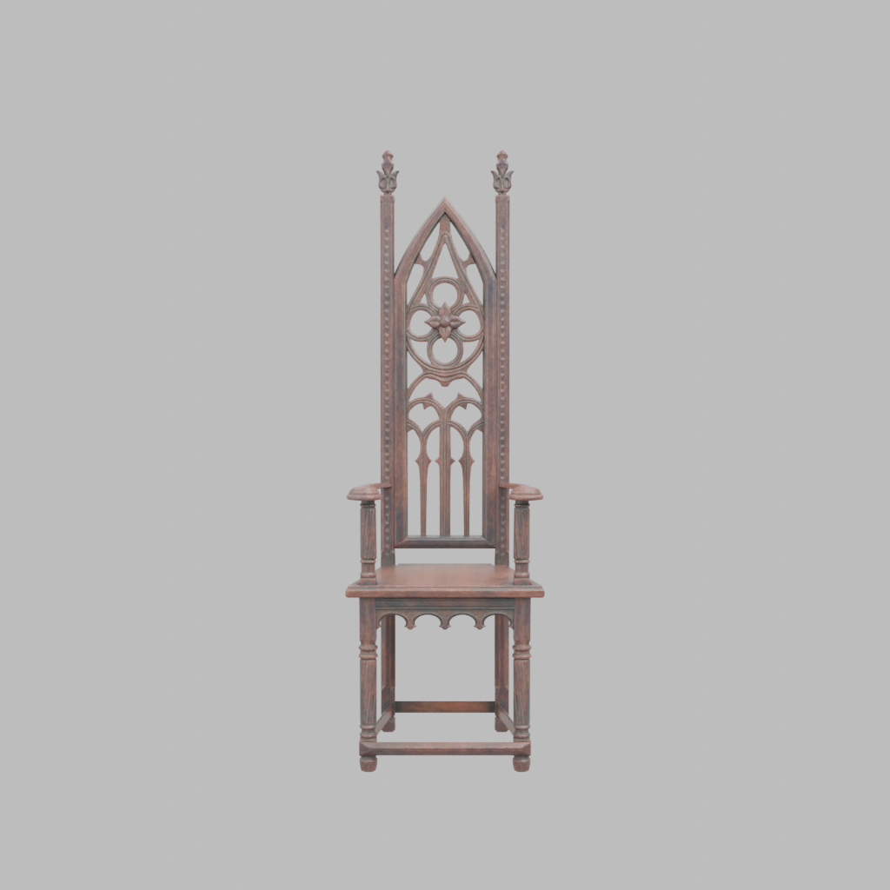
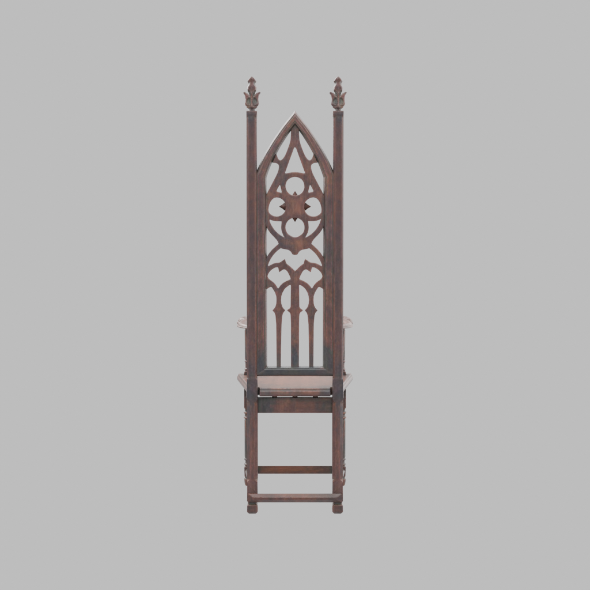
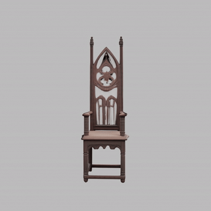

# image-to-rotating-video (CPU-only POC)

Generate a 360° turntable MP4 of a product from **two photos** (front + back).

## Example

**Inputs** — two rendered views of the object:

| Front | Back |
|:---:|:---:|
|  |  |

**Output** — the generated 360° turntable video (textured reconstruction via TRELLIS):

<p align="center">
  <video src="https://github.com/goodluck1103/image-to-rotating-video/releases/download/v0.1.0/turntable.mp4" controls muted loop width="360">
    
  </video>
</p>

<p align="center"><em>If the player doesn't load, here's the same turntable as a GIF:</em></p>
<p align="center">
  
</p>

▶️ Full-quality MP4: [download](https://github.com/goodluck1103/image-to-rotating-video/releases/download/v0.1.0/turntable.mp4) (H.264, 1024×1024, 4s).

---

```
front.png + back.png
   │  01_make_inputs.py   (Blender: render a Poly Haven chair as test input)
   ▼
input/front.png, input/back.png
   │  02_segment.py       (rembg: cut out background → RGBA)
   ▼
work/front_rgba.png, work/back_rgba.png
   │  03_reconstruct.py   (Replicate: multi-view Hunyuan3D-2 → GLB)
   ▼
work/reconstruction.glb
   │  04_render.py        (Blender: 360° turntable, 120 frames, CPU Cycles)
   ▼
work/frames/frame_0000.png …
   │  05_encode.sh        (ffmpeg → H.264/yuv420p)
   ▼
output/turntable.mp4
```

This is a **proof of concept**: one linear flow, no UI/API, minimal error handling.
Everything runs on **CPU** except Step 2, which is offloaded to a hosted GPU on
Replicate.

## Run with Docker (recommended)

The image bakes in **official Blender 4.2 LTS** (Cycles + OpenImageDenoise,
self-contained Python), **ffmpeg**, the Python deps, and the pre-cached rembg
model — so none of the host Blender/OIDN/venv gotchas apply. CPU-only; Step 2 is
offloaded to Replicate over the network.

```bash
export REPLICATE_API_TOKEN=r8_...
docker compose build

# full pipeline (writes to ./input ./work ./output on the host via mounts)
docker compose run --rm pipeline

# quick Workbench preview
FAST=1 docker compose run --rm pipeline

# a single stage
docker compose run --rm pipeline python 01_make_inputs.py --slug ArmChair_01
docker compose run --rm pipeline python 03_reconstruct.py --single
```

`./input`, `./work`, `./output`, and `./assets` are bind-mounted, so all artifacts
persist on the host after the container exits. `REPLICATE_API_TOKEN` is passed in
at run time and never baked into the image.

## Run on the host (alternative, no Docker)

Requirements:
- Linux, Python 3.10+ (validated on 3.12)
- **Blender** on `PATH` — a build **with Cycles + OpenImageDenoise** (the official
  blender.org build works; the Ubuntu `apt` build lacks OIDN — the scripts detect
  this and disable denoising gracefully, but quality is better with OIDN).
- **ffmpeg** on `PATH`
- A **Replicate** token: `export REPLICATE_API_TOKEN=r8_...`

```bash
python3 -m venv .venv
source .venv/bin/activate
pip install -r requirements.txt

export REPLICATE_API_TOKEN=r8_...
./run_all.sh                 # full quality (CPU Cycles turntable)
FAST=1 ./run_all.sh          # Workbench turntable for a quick preview
SLUG=ArmChair_01 ./run_all.sh
```

## Run stages individually

Each stage is independent and reads the previous stage's output from disk, so you
can re-run any one of them.

| Stage | Command | Output |
|---|---|---|
| 0 make inputs | `python 01_make_inputs.py [--slug WoodenChair_01] [--asset path.glb]` | `input/front.png`, `input/back.png` |
| 1 segment | `python 02_segment.py` | `work/front_rgba.png`, `work/back_rgba.png` |
| 2 reconstruct | `python 03_reconstruct.py [--single] [--model trellis]` | `work/reconstruction.glb` |
| 3 render | `python 04_render.py [--fast] [--frames 120] [--samples 64]` | `work/frames/*.png` |
| 4 encode | `./05_encode.sh` (env: `FPS`, `CRF`, `OUT`) | `output/turntable.mp4` |

### Step 0 notes
Downloads a CC0 textured chair (glTF + textures) from the Poly Haven API into
`./assets/<slug>/`. If the download fails, drop any `.glb` into `./assets/` and
run `python 01_make_inputs.py --asset ./assets/yourmodel.glb`. Renders use CPU
Cycles (64 samples) on a plain light-gray background; `--engine BLENDER_WORKBENCH`
is a fast alternative.

### Step 2 notes (Replicate models)
Field names/versions were read from the live Replicate model pages (not guessed).

| Model | Role | Image input | Output field | ~Cost/run |
|---|---|---|---|---|
| `tencent/hunyuan3d-2mv` | **primary** (multi-view) | `front_image`, `back_image` | uri (GLB) | **$0.10** |
| `ndreca/hunyuan3d-2` | fallback (single image) | `image` | `mesh` | $0.15 |
| `firtoz/trellis` | alt (`--model trellis`) | `images[]` (+`generate_model=True`) | `model_file` | $0.034 |

Default behaviour: try multi-view (`front`+`back`); **on any failure, automatically
fall back to single-image on the front cutout only** and log it clearly. Force it
with `--single`.

**Texture vs shape-only (verified on real runs):**
- `tencent/hunyuan3d-2mv` reconstructs excellent **geometry but returns it
  untextured** (flat gray vertex colors) — the turntable renders as a clean
  "clay" model.
- `firtoz/trellis` (`--model trellis`) generates a **textured** GLB (PBR material
  with a 1024² base-color texture) and is cheaper (~$0.034). Use it if you want
  color/texture:
  ```bash
  docker compose run --rm pipeline python 03_reconstruct.py --model trellis
  ```

## Known environment gotchas (handled by the scripts)
- **Blender + venv Python clash:** the orchestrators launch Blender with a scrubbed
  environment (no `PYTHONPATH`/`PYTHONHOME`/`VIRTUAL_ENV`, system `PATH`) so Blender
  uses its own Python instead of the venv/pyenv one (which otherwise crashes the
  glTF importer).
- **No OIDN:** if the Blender build has no OpenImageDenoise, denoising is disabled
  automatically (raise `--samples` to compensate). The Docker image bundles a
  build *with* OIDN.
- **`--fast` background:** the Workbench engine needs a real GL context, which a
  headless CPU container doesn't provide, so its background renders as a neutral
  dark gray instead of light-gray. `--fast` is only for quick previews; the
  default **Cycles** path renders the correct light-gray background.

## Optional local fallback (Step 2b)
A fully-local TripoSR CPU path (single image, no Replicate) is **not** included.
